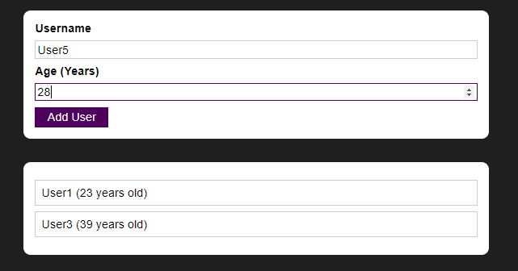

# Time to Practice A Complete Practice ProjectPublic
Basado en el curso "React - the complete guide (incl hooks, React Router, Redux)" de Academind en Udemy




"Time to Practice A Complete Practice ProjectPublic" es un proyecto de practica donde se pone a prueba lo aprendido y crea una webapp similar a un to-do List donde se agrega un usuario, una edad y ademas cuenta con varias validaciones.

## Instalación y Ejecución

Debe tener instalado Node, posterior a ello, solo debe ejecutar los siguientes comandos en la consola en el mismo orden.

```
npm install
npm start
```

